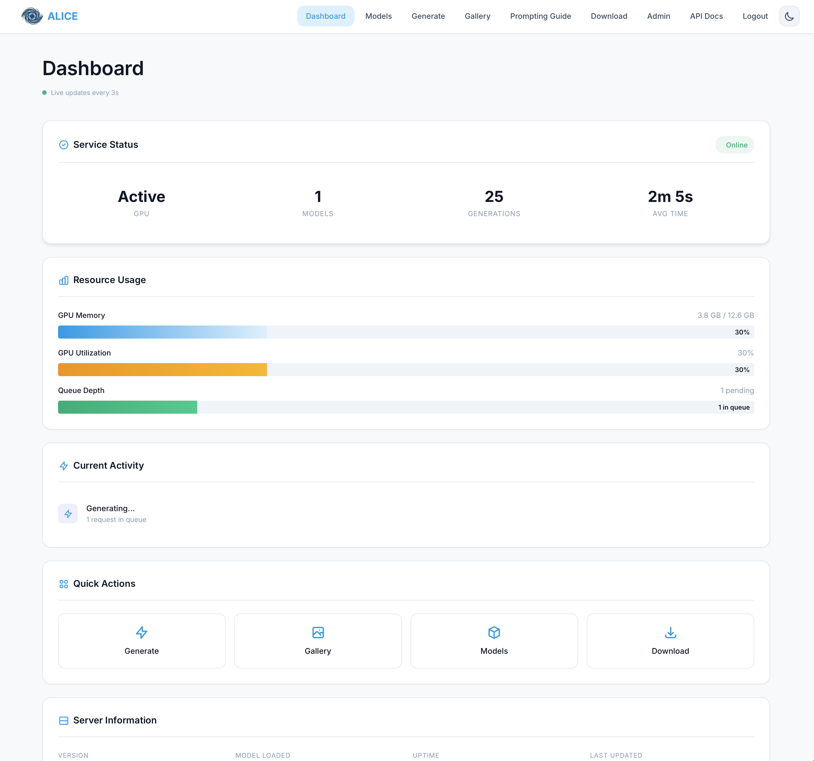
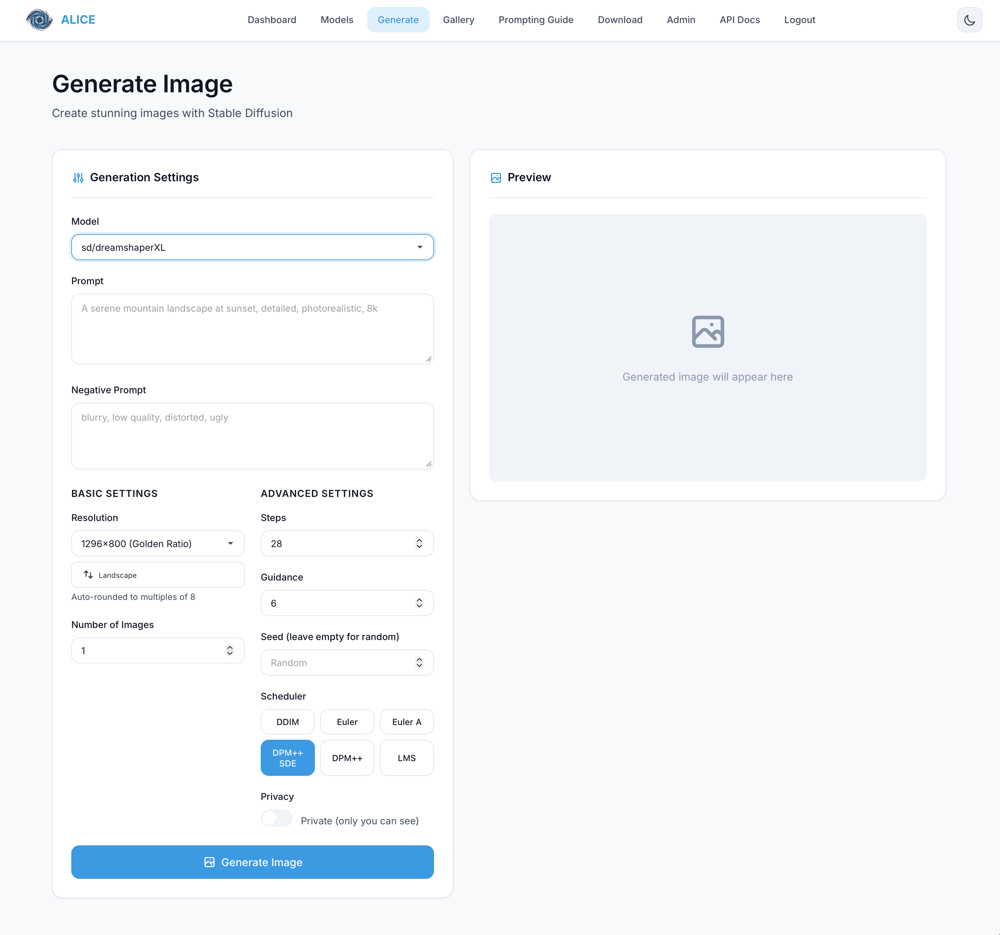

<!-- SPDX-License-Identifier: CC-BY-NC-4.0 -->
<!-- SPDX-FileCopyrightText: Copyright (c) 2025 Andrew Wyatt (Fewtarius) -->

# ALICE - Artificial Latent Image Composition Engine

**Generate beautiful AI images locally. No subscriptions, no cloud uploads, no limits.**

A remote Stable Diffusion service built for privacy, performance, and simplicity. Integrate with SAM, use the web interface, or call the OpenAI-compatible API directly.

[](https://www.gnu.org/licenses/gpl-3.0)
[](https://www.python.org/)
[](https://fastapi.tiangolo.com/)
[](https://github.com/SyntheticAutonomicMind)

[Website](https://www.syntheticautonomicmind.org) | [GitHub](https://github.com/SyntheticAutonomicMind/ALICE) | [Issues](https://github.com/SyntheticAutonomicMind/ALICE/issues) | [Part of Synthetic Autonomic Mind](https://github.com/SyntheticAutonomicMind)

---

## Why ALICE?

Most AI image generation is cloud-dependent, privacy-invasive, and subscription-heavy. ALICE changes that.

Built as part of the Synthetic Autonomic Mind ecosystem, ALICE gives you complete control over image generation:
- **Your GPU, Your Data** - Everything runs locally. Images never leave your machine unless you share them.
- **Built for Integration** - Designed as the image engine for SAM, but works with any client via the OpenAI-compatible API.
- **Fast & Flexible** - Model caching, batch processing, and support for any Stable Diffusion model (SD 1.5, SDXL, FLUX, and more).
- **Production Ready** - Daemon deployment, authentication, privacy controls, and comprehensive monitoring.

---

## What You Can Do with ALICE

### **Generate Custom Images**
Create unique images from text descriptions with full parameter control. Choose from multiple Stable Diffusion models, adjust quality settings, and save your favorite generations.

### **Manage Your Models**
Download models directly from CivitAI and HuggingFace. ALICE automatically detects model types (SD 1.5, SDXL, FLUX) and manages model caching for instant retrieval.

### **Private Gallery**
All your generated images are private by default. Make images public with optional expiration (1-168 hours), and manage your collection with intuitive controls.

### **Privacy Controls**
Fine-grained privacy settings for every image. Admins can manage user access, and all API calls are authenticated with API key support.

### **Integration Ready**
Use the OpenAI-compatible API (`/v1/chat/completions`) from SAM, custom clients, or scripts. Get the same image generation power everywhere.

### **Real-Time Monitoring**
Dashboard shows GPU usage, memory status, generation history, and system metrics. Monitor multiple models and track performance trends.

### **Scale with Confidence**
Max concurrent generation limits, request queuing, and graceful error handling ensure stable performance under load.

---

## Screenshots

Get a glimpse of ALICE's web interface and capabilities:

<table>
  <tr>
    <td width="50%">
      <h3>Dashboard & Control Center</h3>
      
      <em>Real-time system status, GPU monitoring, and quick generation access from the main dashboard</em>
    </td>
    <td width="50%">
      <h3>Advanced Generation Interface</h3>
      
      <em>Full parameter controls: model selection, schedulers, guidance scale, image dimensions, and more</em>
    </td>
  </tr>
</table>

<table>
  <tr>
    <td width="50%">
      <h3>Private Image Gallery</h3>
      
      <em>Organize and manage your generated images with privacy controls, batch operations, and metadata viewing</em>
    </td>
  </tr>
</table>

---

## What Makes ALICE Different

**Complete Privacy**
- All data stays on your hardware
- No cloud accounts required
- Full control over image distribution
- Optional sharing with time-based expiration

**Performance Optimized**
- Model caching for instant second generations
- Batch processing support
- GPU memory management with smart unloading
- Optimized pipelines for NVIDIA, AMD, and Apple Silicon

**Purpose-Built Integration**
- Native integration with SAM
- OpenAI-compatible REST API
- Works with any client that understands the standard
- Lightweight and embeddable

**Enterprise Ready**
- Authentication and API key management
- User role system (admin, user)
- Comprehensive audit logging
- Graceful degradation and error handling

**No External Dependencies**
- Single repository with everything included
- Works offline completely
- Minimal system footprint
- Cross-platform (Linux, macOS)

---

## Core Features

**Multi-Model Support**
- SD 1.5, SD 2.x, SDXL, FLUX, and custom models
- Automatic model type detection
- Single file (`.safetensors`) or diffusers format

**Flexible Scheduling**
- Multiple samplers: DPM++, Euler, DDIM, and more
- Customizable step counts (4-150)
- Seed control for reproducible results

**Image Control**
- Configurable resolutions (512x512 to 2048x2048+)
- Negative prompts for quality refinement
- Guidance scale adjustment for prompt adherence

**Web Management Interface**
- Dashboard with real-time metrics
- Model browser and download manager
- Generation interface with image preview
- Gallery with privacy controls

**Hardware Support**
- NVIDIA GPUs (CUDA) - Recommended
- AMD GPUs (ROCm 6.2+) - Full support
- Apple Silicon (MPS) - Native acceleration
- CPU fallback - Slower but functional

**Deployment Options**
- Standalone web server
- Systemd daemon (Linux)
- Launchd daemon (macOS)
- Docker-ready structure

**API & Integration**
- OpenAI-compatible `/v1/chat/completions` endpoint
- Model listing and refresh endpoints
- Privacy management API
- Metrics and health endpoints

---

## Quick Start

### Development Setup

```bash
# Clone the repository
git clone https://github.com/SyntheticAutonomicMind/ALICE.git
cd alice

# Create virtual environment
python3 -m venv venv
source venv/bin/activate  # On Windows: venv\Scripts\activate

# Install PyTorch (choose your platform below)
# For NVIDIA CUDA:
pip install torch==2.6.0 torchvision==0.21.0 --index-url https://download.pytorch.org/whl/cu124

# For AMD ROCm:
pip install torch==2.6.0 torchvision==0.21.0 --index-url https://download.pytorch.org/whl/rocm6.2

# For CPU only:
pip install torch==2.6.0 torchvision==0.21.0 --index-url https://download.pytorch.org/whl/cpu

# For macOS (Apple Silicon):
pip install torch==2.6.0 torchvision==0.21.0

# Install remaining dependencies
pip install -r requirements.txt

# Create required directories
mkdir -p models images logs

# Add a Stable Diffusion model to ./models
# (Download from Hugging Face, CivitAI, or similar)

# Start the server
python -m src.main

# Open in browser
open http://localhost:8080/web/
```

**For detailed PyTorch installation, see [PYTORCH_INSTALL.md](PYTORCH_INSTALL.md).**

### Production Deployment (SteamOS/Steam Deck)

For SteamOS or Linux systems with user services:

```bash
# Run the automated installer
./scripts/install_steamos.sh

# The installer will:
# - Detect AMD GPU and configure ROCm (if available)
# - Install PyTorch 2.6.0 with correct backend
# - Install all dependencies matching SAM's versions
# - Create systemd user service
# - Start ALICE automatically

# Add models to ~/.local/share/alice/models

# Check status
systemctl --user status alice

# View logs
journalctl --user -u alice -f
```

### Production Deployment (System-wide Linux/macOS)

```bash
# Run the installation script (administrator privilege required)
sudo ./scripts/install.sh

# Add models to /var/lib/alice/models
# Edit configuration if needed: /etc/alice/config.yaml

# Start the service
sudo systemctl start alice           # Linux
sudo launchctl load /Library/LaunchDaemons/com.alice.plist  # macOS

# Check status
sudo systemctl status alice          # Linux
tail -f /var/log/alice/alice.log     # Both
```

---

## Architecture

```
┌─────────────────────────┐
│   Client Application    │
│   (SAM, Scripts, etc.)  │
└────────────┬────────────┘
             │ HTTP POST /v1/chat/completions
             │ {"model": "sd/...", "messages": [...]}
             ▼
┌─────────────────────────┐
│   ALICE Server (FastAPI)│
├─────────────────────────┤
│ • Model Registry        │ Scans ./models directory
│ • Generator Engine      │ PyTorch + diffusers pipeline
│ • Web Management UI     │ Dashboard and controls
│ • Image Storage         │ Gallery with privacy
│ • Authentication        │ API key + session management
└────────────┬────────────┘
             │
             ▼
┌─────────────────────────┐
│   GPU/Accelerator       │
│  CUDA/ROCm/MPS/CPU      │
└─────────────────────────┘
```

### Key Components

- **Model Registry** - Automatically discovers and indexes Stable Diffusion models
- **Generator** - Manages diffusers pipelines with memory optimization
- **Gallery** - Stores image metadata and manages privacy controls
- **Web UI** - React-like interface for management and generation
- **Auth System** - API key and session-based authentication
- **Downloader** - Fetches models from CivitAI and HuggingFace

---

## API Endpoints

### Generate Images

```bash
POST /v1/chat/completions
Content-Type: application/json
Authorization: Bearer <api-key>  # Optional if api_key not configured

{
  "model": "sd/stable-diffusion-v1-5",
  "messages": [
    {"role": "user", "content": "a serene mountain landscape at sunset"}
  ],
  "sam_config": {
    "negative_prompt": "blurry, low quality, oversaturated",
    "steps": 25,
    "guidance_scale": 7.5,
    "width": 512,
    "height": 512,
    "seed": 42,
    "scheduler": "dpm++_sde_karras"
  }
}
```

**Response (OpenAI-compatible):**
```json
{
  "id": "chatcmpl-abc123",
  "object": "chat.completion",
  "created": 1234567890,
  "model": "sd/stable-diffusion-v1-5",
  "choices": [{
    "index": 0,
    "message": {
      "role": "assistant",
      "content": "Image generated successfully.",
      "image_urls": ["http://server:8080/images/abc123.png"]
    },
    "finish_reason": "stop"
  }],
  "usage": {"prompt_tokens": 0, "completion_tokens": 0, "total_tokens": 0}
}
```

### List Available Models

```bash
GET /v1/models
Authorization: Bearer <api-key>
```

Returns all discovered models with metadata:
```json
{
  "object": "list",
  "data": [
    {"id": "sd/stable-diffusion-v1-5", "object": "model", "created": 1234567890, "owned_by": "alice"},
    {"id": "sd/stable-diffusion-xl-base-1.0", "object": "model", "created": 1234567891, "owned_by": "alice"}
  ]
}
```

### Health & Monitoring

**Health Check:**
```bash
GET /health
```

**System Metrics:**
```bash
GET /metrics
```

**Refresh Model Registry:**
```bash
POST /v1/models/refresh
Authorization: Bearer <api-key>
```

### Model Downloads (Admin)

**Search CivitAI:**
```bash
POST /v1/models/search/civitai
{ "query": "", "types": ["Checkpoint"], "limit": 100, "page": 1 }
```

**Search HuggingFace:**
```bash
POST /v1/models/search/huggingface
{ "query": "stable-diffusion", "limit": 100 }
```

**Download from CivitAI:**
```bash
POST /v1/models/download/civitai
{ "modelId": 4384, "versionId": 128713 }
```

**Download from HuggingFace:**
```bash
POST /v1/models/download/huggingface
{ "repoId": "stabilityai/stable-diffusion-xl-base-1.0" }
```

### Image Gallery

**List Gallery:**
```bash
GET /v1/gallery?include_public=true&include_private=true&limit=100
```

**Update Privacy:**
```bash
PATCH /v1/gallery/{image_id}/privacy
{ "isPublic": true, "expiresInHours": 168 }
```

**Delete Image:**
```bash
DELETE /v1/gallery/{image_id}
```

**Admin Operations:**
```bash
GET /v1/gallery/stats                  # Gallery statistics
POST /v1/gallery/cleanup               # Remove expired images
```

---

## Configuration

Edit `config.yaml` to customize ALICE behavior:

```yaml
server:
  host: 0.0.0.0
  port: 8080
  api_key: null                    # Set to require API key authentication
  block_nsfw: true                 # Block NSFW content (recommended)

models:
  directory: ./models              # Where to store/scan models
  auto_unload_timeout: 300         # Unload unused models after this many seconds
  default_model: stable-diffusion-v1-5

generation:
  default_steps: 25                # Default sampling steps
  default_guidance_scale: 7.5      # Default guidance strength
  default_scheduler: dpm++_sde_karras
  max_concurrent: 1                # Max simultaneous generations
  request_timeout: 300             # Generation timeout in seconds
  default_width: 512
  default_height: 512

storage:
  images_directory: ./images       # Where to save generated images
  max_storage_gb: 100              # Maximum storage before cleanup
  retention_days: 7                # Default expiration for public images

logging:
  level: INFO                      # Log level (DEBUG, INFO, WARNING, ERROR)
  file: ./logs/alice.log
```

### NSFW Content Filtering

ALICE includes comprehensive NSFW filtering (enabled by default):

- 100+ explicit keyword detection
- Obfuscation detection (leetspeak, spacing, symbols)
- Unicode substitution detection
- Context-based pattern matching

Disable in `config.yaml`:
```yaml
server:
  block_nsfw: false
```

---

## Supported Models & Formats

### Model Architectures
- **Stable Diffusion 1.5** - 512×512 native resolution
- **Stable Diffusion 2.x** - 768×768 native resolution
- **SDXL** - 1024×1024 native resolution
- **FLUX** - High-quality model with extended capabilities
- **Custom Models** - Any Stable Diffusion variant

### File Formats
- **Diffusers Format** - Directory with `model_index.json` (recommended)
- **SafeTensors** - Single `.safetensors` checkpoint file
- **Model Naming** - All models use `sd/` prefix (e.g., `sd/my-custom-model`)

### Available Schedulers
- `dpm++_sde_karras` (default - recommended)
- `dpm++_karras`
- `euler_a`
- `euler`
- `ddim`
- `pndm`
- `lms`

---

## Hardware Support

### NVIDIA GPUs (CUDA)

Recommended platform. PyTorch with CUDA 12.4 support.

```bash
pip install torch==2.6.0 torchvision==0.21.0 --index-url https://download.pytorch.org/whl/cu124
```

Requirements: NVIDIA GPU with 8GB+ VRAM (4GB minimum for smaller models).

### AMD GPUs (ROCm 6.2)

Full support including specialized configs for Phoenix APUs (gfx1103).

```bash
pip install torch==2.6.0 torchvision==0.21.0 --index-url https://download.pytorch.org/whl/rocm6.2
```

**For Phoenix APU (Steam Deck):** See [docs/AMD-DEPLOYMENT-GUIDE.md](docs/AMD-DEPLOYMENT-GUIDE.md) for special configuration.

### Apple Silicon (MPS)

Native acceleration for M1/M2/M3 chips.

```bash
pip install torch==2.6.0 torchvision==0.21.0
```

No additional configuration needed. MPS acceleration is automatic.

### CPU (Fallback)

Works on any system with Python 3.10+, but generation is significantly slower.

```bash
pip install torch==2.6.0 torchvision==0.21.0 --index-url https://download.pytorch.org/whl/cpu
```

---

## Web Interface

Access ALICE's management interface at **`http://localhost:8080/web/`**

### Dashboard
- System status and GPU memory visualization
- Quick generation form
- Recent generations gallery
- Real-time metrics

### Models Tab
- Browse available models
- Auto-detected model types
- Refresh model registry
- Model details and metadata

### Generate Tab
- Full parameter controls:
  - Model selection
  - Positive and negative prompts
  - Resolution presets or custom dimensions
  - Sampling steps and guidance scale
  - Scheduler selection
  - Seed control
- Generation log with timestamps
- Image preview and download

### Gallery Tab
- Masonry grid of all generated images
- Privacy status (private/public)
- Model and settings metadata
- Quick actions:
  - Regenerate with same settings
  - Delete images
  - Manage privacy
  - Download images

### Download Tab (Admin)
- Browse and search CivitAI models
- Search HuggingFace models
- One-click downloading with progress
- Automatic model type detection

### Admin Panel
- User management
- API key generation and revocation
- System configuration
- Cleanup operations

---

## Project Structure

```
alice/
├── src/                          # Python source code
│   ├── main.py                   # FastAPI application and endpoints
│   ├── config.py                 # Configuration management (Pydantic)
│   ├── model_registry.py         # Model discovery and management
│   ├── generator.py              # Image generation engine
│   ├── model_cache.py            # Model loading and caching
│   ├── gallery.py                # Image storage and privacy
│   ├── auth.py                   # Authentication and sessions
│   ├── downloader.py             # CivitAI and HuggingFace downloads
│   └── schemas.py                # Request/response Pydantic models
├── web/                          # Web interface and static assets
│   ├── index.html                # Dashboard
│   ├── generate.html             # Generation interface
│   ├── gallery.html              # Image gallery
│   ├── models.html               # Model management
│   ├── download.html             # Model downloader
│   ├── admin.html                # Admin panel
│   ├── app.js                    # JavaScript client library
│   ├── style.css                 # UI styling
│   ├── alice-logo.png            # Branding
│   └── fonts/                    # Local fonts (no CDN)
├── scripts/                      # Deployment and utility scripts
│   ├── install.sh                # System-wide installation
│   ├── install_steamos.sh        # SteamOS/Steam Deck installation
│   └── detect_amd_gpu.sh         # AMD GPU detection
├── tests/                        # Unit and integration tests
│   └── test_api.py               # API endpoint tests
├── docs/                         # Documentation
│   ├── ARCHITECTURE.md           # System architecture
│   ├── IMPLEMENTATION_GUIDE.md   # Development guide
│   └── AMD-DEPLOYMENT-GUIDE.md   # AMD/ROCm setup
├── data/                         # Runtime data (created on startup)
│   ├── auth/                     # API keys and sessions
│   └── gallery.json              # Image metadata
├── config.yaml                   # Configuration file
├── requirements.txt              # Python dependencies
├── alice.service                 # systemd service unit
├── Makefile                      # Build and development commands
├── PYTORCH_INSTALL.md            # PyTorch installation guide
├── README.md                     # This file
└── LICENSE                       # GPL-3.0 License
```

---

## Requirements

### System Requirements
- **Python** 3.10 or newer
- **RAM** 16GB minimum (32GB recommended for SDXL/FLUX)
- **Disk** 50GB+ for model storage
- **GPU** 8GB+ VRAM recommended (4GB for smaller models)

### Python Dependencies

Key packages (see [requirements.txt](requirements.txt) for complete list):

- **PyTorch** 2.6.0 (with platform-specific backend)
- **diffusers** 0.35.2 (Stable Diffusion pipelines)
- **transformers** 4.57.3 (Model tokenizers)
- **accelerate** 1.12.0 (GPU optimization)
- **compel** 2.3.1 (Prompt weighting)
- **FastAPI** 0.104.1 (Web framework)
- **Pydantic** 2.12.5 (Data validation)

All Python versions match SAM's bundled environment for compatibility.

---

## Development

Use Makefile for common development tasks:

```bash
# Install dependencies
make install

# Run in development mode (auto-reload on file changes)
make dev

# Run tests
make test

# Run linter
make lint

# Clean build artifacts
make clean
```

Or use Python directly:

```bash
# Start dev server
python -m src.main

# Run specific test
python -m pytest tests/test_api.py -v
```

---

## Troubleshooting

### Server won't start

**Check logs:**
```bash
tail -f logs/alice.log                    # Development
tail -f /var/log/alice/alice.log          # System-wide
journalctl --user -u alice -f             # SteamOS user service
```

**Verify Python:**
```bash
which python3
python3 --version  # Should be 3.10+
```

**Check port availability:**
```bash
lsof -i :8080
```

### Model not loading

- Verify model path exists in `./models/`
- Check model format: must be diffusers directory or `.safetensors` file
- Ensure sufficient VRAM/RAM for model size
- Check logs for parsing errors

### Generation fails or times out

- Check available GPU memory: `nvidia-smi` or `rocm-smi`
- Try smaller resolution (512×512 instead of 1024×1024)
- Reduce `max_concurrent` to 1 in config
- Increase `request_timeout` if generation is slow
- Check for VRAM-related errors in logs

### High GPU memory usage

Enable VAE slicing and attention slicing (automatic for large models):
```yaml
generation:
  vae_slicing: true
  attention_slicing: auto
```

### AMD GPU issues (ROCm)

See [docs/AMD-DEPLOYMENT-GUIDE.md](docs/AMD-DEPLOYMENT-GUIDE.md) for detailed troubleshooting.

Common issues:
- Phoenix APU requires special PyTorch builds (see deployment guide)
- Verify ROCm installation: `rocm-smi`
- Check `HSA_OVERRIDE_GFX_VERSION` environment variable

### Authentication/Session issues

- Verify `api_key` is set correctly in `config.yaml`
- Check API key is in request headers: `Authorization: Bearer YOUR_KEY`
- Check session storage in `data/auth/`
- Inspect session tokens in logs

---

## Image Privacy

All generated images follow a privacy-first model:

- **Private by Default** - Only the owner can access their images
- **Optional Sharing** - Make images public with optional time-based expiration (1-168 hours)
- **Admin Override** - Administrators can view and manage all images
- **Auto-Cleanup** - Expired public images are deleted hourly
- **Ownership Tracking** - Every image is linked to a user account

---

## License & Credits

**License:** GNU General Public License v3.0 ([GPL-3.0](LICENSE))

**Part of:** [Synthetic Autonomic Mind](https://github.com/SyntheticAutonomicMind)

**Built by:** Andrew Wyatt (Fewtarius) with AI-assisted development

ALICE stands on the shoulders of giants:
- [Stable Diffusion](https://github.com/CompVis/stable-diffusion)
- [diffusers](https://github.com/huggingface/diffusers)
- [FastAPI](https://github.com/tiangolo/fastapi)
- [PyTorch](https://pytorch.org/)
- The open-source AI and machine learning community

---

**Ready to generate? [Get started now!](https://github.com/SyntheticAutonomicMind/ALICE#quick-start)**
