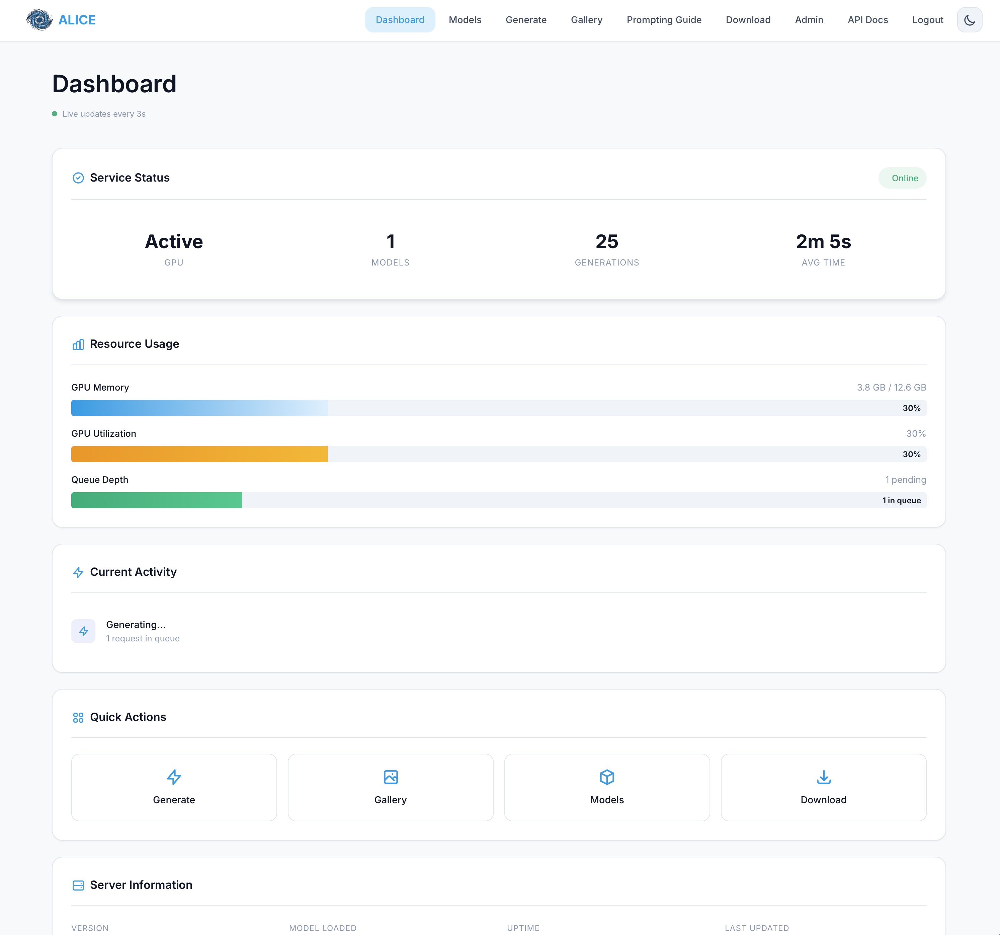
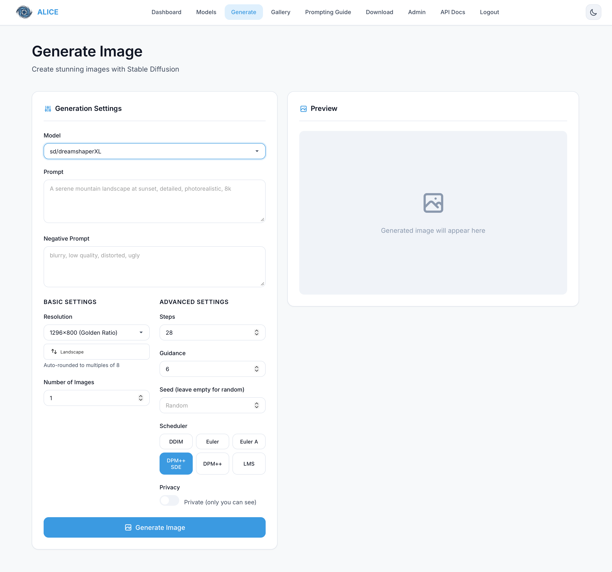
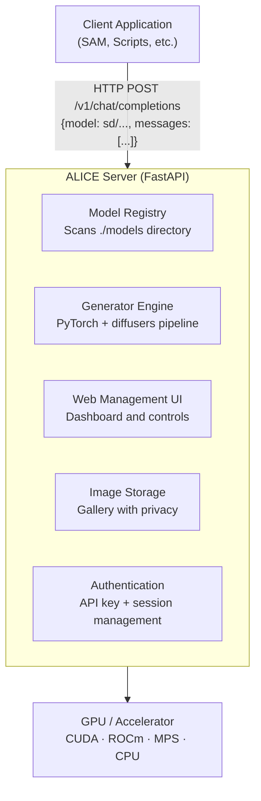

<!-- SPDX-License-Identifier: CC-BY-NC-4.0 -->
<!-- SPDX-FileCopyrightText: Copyright (c) 2025 Andrew Wyatt (Fewtarius) -->

# ALICE - Artificial Latent Image Composition Engine

**Local AI image generation for SAM - and anyone else who wants private, unlimited image generation on their own hardware.**

ALICE is a Stable Diffusion service that runs on your Mac (or Linux machine). SAM uses it to generate images: you describe what you want, SAM asks ALICE, and ALICE produces the image locally using your GPU. No subscription, no cloud upload, no per-image cost.

[](https://www.gnu.org/licenses/gpl-3.0)
[](https://www.python.org/)
[](https://fastapi.tiangolo.com/)
[](https://github.com/SyntheticAutonomicMind)

[Website](https://www.syntheticautonomicmind.org) | [GitHub](https://github.com/SyntheticAutonomicMind/ALICE) | [Issues](https://github.com/SyntheticAutonomicMind/ALICE/issues) | [Part of Synthetic Autonomic Mind](https://github.com/SyntheticAutonomicMind)

---

## What ALICE does

ALICE is the image generation engine behind SAM's "generate an image" capability. When you ask SAM to create an image, ALICE does the work:

1. SAM sends your description to ALICE
2. ALICE generates the image on your machine using your GPU
3. SAM displays the result

Everything happens locally. Your prompts and images never leave your hardware.

**Works on:**
- Apple Silicon Macs (M1/M2/M3/M4) - GPU accelerated via Metal
- Intel Macs - CPU only (slower, but functional)
- Linux with NVIDIA or AMD GPU

You can also use ALICE directly through its own web interface at `http://localhost:8080/web/`, or connect it to any client that supports the OpenAI image API.

---

## Quick Install

ALICE requires two things to work: the software (installed below) and at least one Stable Diffusion model. Models are the AI files that actually generate images - you'll need to download one separately after installing ALICE. The [Getting Models](#getting-models) section below walks you through it.

### macOS (SAM integration)

ALICE runs as a user service - no `sudo` required. Apple Silicon Macs (M1/M2/M3/M4) get GPU-accelerated generation via Metal (MPS). Intel Macs run CPU-only.

**Prerequisites:** [Homebrew](https://brew.sh) and Python 3.10+

```bash
# Install Homebrew if you don't have it
/bin/bash -c "$(curl -fsSL https://raw.githubusercontent.com/Homebrew/install/HEAD/install.sh)"

# Install Python 3.10+
brew install python
```

**Install ALICE:**

```bash
git clone https://github.com/SyntheticAutonomicMind/ALICE.git && cd ALICE

# Background service (recommended - starts automatically at login):
./scripts/install_macos.sh

# Or install without the background service (start manually):
./scripts/install_macos.sh --manual
```

The installer detects your Mac's architecture, installs PyTorch with the right backend (MPS for Apple Silicon, CPU for Intel), and sets up the service. It runs entirely as your user account.

**Service management:**

```bash
launchctl start com.alice          # Start
launchctl stop com.alice           # Stop
launchctl unload ~/Library/LaunchAgents/com.alice.plist  # Disable auto-start
tail -f ~/Library/Logs/alice/alice.log                   # Logs
```

**Manual start (if installed with --manual):**

```bash
cd ~/Library/"Application Support"/alice
ALICE_CONFIG=~/.config/alice/config.yaml venv/bin/python -m src.main
```

**Connect to SAM:**

1. Make sure ALICE is running - open `http://localhost:8080/health` in a browser to check
2. In SAM go to **Settings > Image Generation**
3. Set the server URL to `http://localhost:8080`
4. Download a model (see [Getting Models](#getting-models) below)
5. You're ready - ask SAM to generate an image

For a full macOS setup guide including troubleshooting, see [docs/MACOS-DEPLOYMENT.md](docs/MACOS-DEPLOYMENT.md).

---

### Linux (one-liner)

```bash
TAG="$(curl -s https://api.github.com/repos/SyntheticAutonomicMind/ALICE/releases/latest | python3 -c "import sys,json;print(json.load(sys.stdin)['tag_name'])")"
VERSION="${TAG#v}"
curl -sL "https://github.com/SyntheticAutonomicMind/ALICE/releases/download/${TAG}/alice-${VERSION}.tar.gz" | tar xz && cd alice-* && sudo ./scripts/install.sh
```

Installs as a systemd service to `/opt/alice`. Detects AMD (ROCm), NVIDIA (CUDA), and CPU-only automatically.

### Docker

```bash
git clone https://github.com/SyntheticAutonomicMind/ALICE.git && cd ALICE
make docker-up-cuda   # NVIDIA
make docker-up-rocm   # AMD
make docker-up        # CPU only
```

---

## Getting Models

ALICE needs at least one Stable Diffusion model to generate images. A model is a large file (2-10GB) that contains the AI's learned knowledge about images. ALICE does not ship with models - you download them separately.

### Recommended for most users: SDXL

SDXL produces high-quality images at 1024x1024. It requires about 6-8GB of memory (unified memory on Apple Silicon).

- **[Juggernaut XL](https://civitai.com/models/133005)** - Photorealistic, great all-rounder
- **[DreamShaper XL](https://civitai.com/models/112902)** - Versatile, handles artistic styles well
- **[RealVisXL](https://civitai.com/models/139562)** - Realistic portraits and scenes

### Good for Macs with 8GB or less unified memory: SD 1.5

SD 1.5 models are smaller (2-4GB) and work well on lower-memory systems. Native resolution is 512x512.

- **[Realistic Vision](https://civitai.com/models/4201)** - Photorealistic
- **[DreamShaper](https://civitai.com/models/4384)** - General purpose
- **[Deliberate](https://civitai.com/models/4823)** - Detailed and flexible

### How to download

**Option 1 - ALICE web interface (easiest)**

Open `http://localhost:8080/web/` and go to the **Download** tab. Search for a model by name on CivitAI or HuggingFace and click Download. ALICE handles the rest.

**Option 2 - Download manually**

Download a `.safetensors` file from [CivitAI](https://civitai.com) or [HuggingFace](https://huggingface.co) and place it in:

- **macOS:** `~/Library/Application Support/alice/data/models/`
- **Linux:** `/var/lib/alice/models/` (system install) or `~/.local/share/alice/models/` (SteamOS)

ALICE auto-discovers models on startup and when you refresh the model list.

### After downloading

In the ALICE web interface at `http://localhost:8080/web/`, go to the **Models** tab and click **Refresh** to pick up the new model. It will then appear in SAM's image generation settings automatically.

---

## Screenshots

Get a glimpse of ALICE's web interface and capabilities:

<table>
  <tr>
    <td width="50%">
      <h3>Dashboard & Control Center</h3>
      
      <em>Real-time system status, GPU monitoring, and quick generation access from the main dashboard</em>
    </td>
    <td width="50%">
      <h3>Advanced Generation Interface</h3>
      
      <em>Full parameter controls: model selection, schedulers, guidance scale, image dimensions, and more</em>
    </td>
  </tr>
</table>

<table>
  <tr>
    <td width="50%">
      <h3>Private Image Gallery</h3>
      
      <em>Organize and manage your generated images with privacy controls, batch operations, and metadata viewing</em>
    </td>
  </tr>
</table>

---

## What Makes ALICE Different

**Complete Privacy**
- All data stays on your hardware
- No cloud accounts required
- Full control over image distribution
- Optional sharing with time-based expiration

**Performance Optimized**
- Model caching for instant second generations
- Batch processing support
- GPU memory management with smart unloading
- Optimized pipelines for NVIDIA, AMD, and Apple Silicon

**Purpose-Built Integration**
- Native integration with SAM
- OpenAI-compatible REST API
- Works with any client that understands the standard
- Lightweight and embeddable

**Authentication & Multi-User**
- API key management
- User role system (admin, user)
- Comprehensive audit logging
- Graceful degradation and error handling

**Self-Contained**
- Single repository with everything included
- Works offline completely
- Minimal system footprint
- Cross-platform (Linux, macOS)

---

## Core Features

**Multi-Model Support**
- SD 1.5, SD 2.x, SDXL, FLUX, and custom models
- Automatic model type detection
- Single file (`.safetensors`) or diffusers format

**Flexible Scheduling**
- Multiple samplers: DPM++, Euler, DDIM, and more
- Customizable step counts (4-150)
- Seed control for reproducible results

**Image Control**
- Configurable resolutions (512x512 to 2048x2048+)
- Negative prompts for quality refinement
- Guidance scale adjustment for prompt adherence

**Web Management Interface**
- Dashboard with real-time metrics
- Model browser and download manager
- Generation interface with image preview
- Gallery with privacy controls

**Hardware Support**
- NVIDIA GPUs (CUDA) - Recommended
- AMD GPUs (ROCm 6.2+) - Full support
- Apple Silicon (MPS) - Native acceleration
- CPU fallback - Slower but functional

**Deployment Options**
- Standalone web server
- Systemd daemon (Linux)
- Launchd daemon (macOS)
- Docker-ready structure

**API & Integration**
- OpenAI-compatible `/v1/chat/completions` endpoint
- Model listing and refresh endpoints
- Privacy management API
- Metrics and health endpoints

---

## Quick Start

> **Just want to use ALICE with SAM?** Start at [Quick Install](#quick-install) above and use the installer script for your platform. This section is for running ALICE from source for development.

### Production Deployment (SteamOS/Steam Deck)

For SteamOS or Linux systems with user services:

```bash
# Run the automated installer
./scripts/install_steamos.sh

# The installer will:
# - Detect AMD GPU and configure ROCm (if available)
# - Install PyTorch 2.6.0 with correct backend
# - Install all dependencies matching SAM's versions
# - Create systemd user service
# - Start ALICE automatically

# Add models to ~/.local/share/alice/models

# Check status
systemctl --user status alice

# View logs
journalctl --user -u alice -f
```

### Production Deployment (System-wide Linux/macOS)

```bash
# Run the installation script (administrator privilege required)
sudo ./scripts/install.sh

# Add models to /var/lib/alice/models
# Edit configuration if needed: /etc/alice/config.yaml

# Start the service
sudo systemctl start alice           # Linux

# Check status
sudo systemctl status alice          # Linux
tail -f /var/log/alice/alice.log     # Both
```

> **macOS users:** Use `./scripts/install_macos.sh` instead - it installs as your user account without `sudo` and is the recommended method. See [Quick Install](#quick-install).

---

## Architecture


```mermaid
flowchart TD
    Client["Client Application<br/>(SAM, Scripts, etc.)"]
    Client -->|"HTTP POST /v1/chat/completions<br/>{model: sd/..., messages: [...]}"| Server

    subgraph Server["ALICE Server (FastAPI)"]
        Registry["Model Registry<br/>Scans ./models directory"]
        Generator["Generator Engine<br/>PyTorch + diffusers pipeline"]
        WebUI["Web Management UI<br/>Dashboard and controls"]
        Gallery["Image Storage<br/>Gallery with privacy"]
        Auth["Authentication<br/>API key + session management"]
    end

    Server --> GPU["GPU / Accelerator<br/>CUDA · ROCm · MPS · CPU"]
```

### Key Components

- **Model Registry** - Automatically discovers and indexes Stable Diffusion models
- **Generator** - Manages diffusers pipelines with memory optimization
- **Gallery** - Stores image metadata and manages privacy controls
- **Web UI** - React-like interface for management and generation
- **Auth System** - API key and session-based authentication
- **Downloader** - Fetches models from CivitAI and HuggingFace

---

## API Endpoints

### Generate Images

```bash
POST /v1/chat/completions
Content-Type: application/json
Authorization: Bearer <api-key>  # Optional if api_key not configured

{
  "model": "sd/stable-diffusion-v1-5",
  "messages": [
    {"role": "user", "content": "a serene mountain landscape at sunset"}
  ],
  "sam_config": {
    "negative_prompt": "blurry, low quality, oversaturated",
    "steps": 25,
    "guidance_scale": 7.5,
    "width": 512,
    "height": 512,
    "seed": 42,
    "scheduler": "dpm++_sde_karras"
  }
}
```

**Response (OpenAI-compatible):**
```json
{
  "id": "chatcmpl-abc123",
  "object": "chat.completion",
  "created": 1234567890,
  "model": "sd/stable-diffusion-v1-5",
  "choices": [{
    "index": 0,
    "message": {
      "role": "assistant",
      "content": "Image generated successfully.",
      "image_urls": ["http://server:8080/images/abc123.png"]
    },
    "finish_reason": "stop"
  }],
  "usage": {"prompt_tokens": 0, "completion_tokens": 0, "total_tokens": 0}
}
```

### List Available Models

```bash
GET /v1/models
Authorization: Bearer <api-key>
```

Returns all discovered models with metadata:
```json
{
  "object": "list",
  "data": [
    {"id": "sd/stable-diffusion-v1-5", "object": "model", "created": 1234567890, "owned_by": "alice"},
    {"id": "sd/stable-diffusion-xl-base-1.0", "object": "model", "created": 1234567891, "owned_by": "alice"}
  ]
}
```

### Health & Monitoring

**Health Check:**
```bash
GET /health
```

**System Metrics:**
```bash
GET /metrics
```

**Refresh Model Registry:**
```bash
POST /v1/models/refresh
Authorization: Bearer <api-key>
```

### Model Downloads (Admin)

**Search CivitAI:**
```bash
POST /v1/models/search/civitai
{ "query": "", "types": ["Checkpoint"], "limit": 100, "page": 1 }
```

**Search HuggingFace:**
```bash
POST /v1/models/search/huggingface
{ "query": "stable-diffusion", "limit": 100 }
```

**Download from CivitAI:**
```bash
POST /v1/models/download/civitai
{ "modelId": 4384, "versionId": 128713 }
```

**Download from HuggingFace:**
```bash
POST /v1/models/download/huggingface
{ "repoId": "stabilityai/stable-diffusion-xl-base-1.0" }
```

### Image Gallery

**List Gallery:**
```bash
GET /v1/gallery?include_public=true&include_private=true&limit=100
```

**Update Privacy:**
```bash
PATCH /v1/gallery/{image_id}/privacy
{ "isPublic": true, "expiresInHours": 168 }
```

**Delete Image:**
```bash
DELETE /v1/gallery/{image_id}
```

**Admin Operations:**
```bash
GET /v1/gallery/stats                  # Gallery statistics
POST /v1/gallery/cleanup               # Remove expired images
```

---

## Configuration

Edit `config.yaml` to customize ALICE behavior:

```yaml
server:
  host: 0.0.0.0
  port: 8080
  api_key: null                    # Set to require API key authentication
  block_nsfw: true                 # Block NSFW content (recommended)

models:
  directory: ./models              # Where to store/scan models
  auto_unload_timeout: 300         # Unload unused models after this many seconds
  default_model: stable-diffusion-v1-5

generation:
  default_steps: 25                # Default sampling steps
  default_guidance_scale: 7.5      # Default guidance strength
  default_scheduler: dpm++_sde_karras
  max_concurrent: 1                # Max simultaneous generations
  request_timeout: 300             # Generation timeout in seconds
  default_width: 512
  default_height: 512

storage:
  images_directory: ./images       # Where to save generated images
  max_storage_gb: 100              # Maximum storage before cleanup
  retention_days: 7                # Default expiration for public images

logging:
  level: INFO                      # Log level (DEBUG, INFO, WARNING, ERROR)
  file: ./logs/alice.log
```

### NSFW Content Filtering

ALICE includes comprehensive NSFW filtering (enabled by default):

- 100+ explicit keyword detection
- Obfuscation detection (leetspeak, spacing, symbols)
- Unicode substitution detection
- Context-based pattern matching

Disable in `config.yaml`:
```yaml
server:
  block_nsfw: false
```

---

## Supported Models & Formats

### Model Architectures
- **Stable Diffusion 1.5** - 512×512 native resolution
- **Stable Diffusion 2.x** - 768×768 native resolution
- **SDXL** - 1024×1024 native resolution
- **FLUX** - High-quality model with extended capabilities
- **Custom Models** - Any Stable Diffusion variant

### File Formats
- **Diffusers Format** - Directory with `model_index.json` (recommended)
- **SafeTensors** - Single `.safetensors` checkpoint file
- **Model Naming** - All models use `sd/` prefix (e.g., `sd/my-custom-model`)

### Available Schedulers
- `dpm++_sde_karras` (default - recommended)
- `dpm++_karras`
- `euler_a`
- `euler`
- `ddim`
- `pndm`
- `lms`

---

## Hardware Support

### NVIDIA GPUs (CUDA)

Recommended platform. PyTorch with CUDA 12.4 support.

```bash
pip install torch==2.6.0 torchvision==0.21.0 --index-url https://download.pytorch.org/whl/cu124
```

Requirements: NVIDIA GPU with 8GB+ VRAM (4GB minimum for smaller models).

### AMD GPUs (ROCm 6.2)

Full support including specialized configs for Phoenix APUs (gfx1103).

```bash
pip install torch==2.6.0 torchvision==0.21.0 --index-url https://download.pytorch.org/whl/rocm6.2
```

**For Phoenix APU (Steam Deck):** See [docs/AMD-DEPLOYMENT-GUIDE.md](docs/AMD-DEPLOYMENT-GUIDE.md) for special configuration.

### Apple Silicon (MPS)

Native acceleration for M1/M2/M3 chips.

```bash
pip install torch==2.6.0 torchvision==0.21.0
```

No additional configuration needed. MPS acceleration is automatic.

### CPU (Fallback)

Works on any system with Python 3.10+, but generation is significantly slower.

```bash
pip install torch==2.6.0 torchvision==0.21.0 --index-url https://download.pytorch.org/whl/cpu
```

---

## Web Interface

Access ALICE's management interface at **`http://localhost:8080/web/`**

### Dashboard
- System status and GPU memory visualization
- Quick generation form
- Recent generations gallery
- Real-time metrics

### Models Tab
- Browse available models
- Auto-detected model types
- Refresh model registry
- Model details and metadata

### Generate Tab
- Full parameter controls:
  - Model selection
  - Positive and negative prompts
  - Resolution presets or custom dimensions
  - Sampling steps and guidance scale
  - Scheduler selection
  - Seed control
- Generation log with timestamps
- Image preview and download

### Gallery Tab
- Masonry grid of all generated images
- Privacy status (private/public)
- Model and settings metadata
- Quick actions:
  - Regenerate with same settings
  - Delete images
  - Manage privacy
  - Download images

### Download Tab (Admin)
- Browse and search CivitAI models
- Search HuggingFace models
- One-click downloading with progress
- Automatic model type detection

### Admin Panel
- User management
- API key generation and revocation
- System configuration
- Cleanup operations

---

## Project Structure

```
alice/
├── src/                          # Python source code
│   ├── main.py                   # FastAPI application and endpoints
│   ├── config.py                 # Configuration management (Pydantic)
│   ├── model_registry.py         # Model discovery and management
│   ├── generator.py              # Image generation engine
│   ├── model_cache.py            # Model loading and caching
│   ├── gallery.py                # Image storage and privacy
│   ├── auth.py                   # Authentication and sessions
│   ├── downloader.py             # CivitAI and HuggingFace downloads
│   └── schemas.py                # Request/response Pydantic models
├── web/                          # Web interface and static assets
│   ├── index.html                # Dashboard
│   ├── generate.html             # Generation interface
│   ├── gallery.html              # Image gallery
│   ├── models.html               # Model management
│   ├── download.html             # Model downloader
│   ├── admin.html                # Admin panel
│   ├── app.js                    # JavaScript client library
│   ├── style.css                 # UI styling
│   ├── alice-logo.png            # Branding
│   └── fonts/                    # Local fonts (no CDN)
├── scripts/                      # Deployment and utility scripts
│   ├── install.sh                # System-wide installation
│   ├── install_macos.sh          # macOS user installation (recommended for Mac)
│   ├── install_steamos.sh        # SteamOS/Steam Deck installation
│   └── detect_amd_gpu.sh         # AMD GPU detection
├── tests/                        # Unit and integration tests
│   └── test_api.py               # API endpoint tests
├── docs/                         # Documentation
│   ├── ARCHITECTURE.md           # System architecture
│   ├── IMPLEMENTATION_GUIDE.md   # Development guide
│   ├── AMD-DEPLOYMENT-GUIDE.md   # AMD/ROCm setup
│   └── MACOS-DEPLOYMENT.md       # macOS setup guide
├── data/                         # Runtime data (created on startup)
│   ├── auth/                     # API keys and sessions
│   └── gallery.json              # Image metadata
├── config.yaml                   # Configuration file
├── requirements.txt              # Python dependencies
├── alice.service                 # systemd service unit
├── Makefile                      # Build and development commands
├── PYTORCH_INSTALL.md            # PyTorch installation guide
├── README.md                     # This file
└── LICENSE                       # GPL-3.0 License
```

---

## Requirements

### System Requirements
- **Python** 3.10 or newer
- **RAM** 16GB minimum (32GB recommended for SDXL/FLUX)
- **Disk** 50GB+ for model storage
- **GPU** 8GB+ VRAM recommended (4GB for smaller models)

### Python Dependencies

Key packages (see [requirements.txt](requirements.txt) for complete list):

- **PyTorch** 2.6.0 (with platform-specific backend)
- **diffusers** 0.35.2 (Stable Diffusion pipelines)
- **transformers** 4.57.3 (Model tokenizers)
- **accelerate** 1.12.0 (GPU optimization)
- **compel** 2.3.1 (Prompt weighting)
- **FastAPI** 0.104.1 (Web framework)
- **Pydantic** 2.12.5 (Data validation)

All Python versions match SAM's bundled environment for compatibility.

---

## Development

Use Makefile for common development tasks:

```bash
# Install dependencies
make install

# Run in development mode (auto-reload on file changes)
make dev

# Run tests
make test

# Run linter
make lint

# Clean build artifacts
make clean
```

Or use Python directly:

```bash
# Start dev server
python -m src.main

# Run specific test
python -m pytest tests/test_api.py -v
```

---

## Troubleshooting

### Server won't start

**Check logs:**
```bash
tail -f logs/alice.log                    # Development
tail -f /var/log/alice/alice.log          # System-wide
journalctl --user -u alice -f             # SteamOS user service
```

For macOS service installs: `tail -f ~/Library/Logs/alice/alice.log`

**Verify Python:**
```bash
which python3
python3 --version  # Should be 3.10+
```

**Check port availability:**
```bash
lsof -i :8080
```

### Model not loading

- Verify model path exists in `./models/`
- Check model format: must be diffusers directory or `.safetensors` file
- Ensure sufficient VRAM/RAM for model size
- Check logs for parsing errors

### Generation fails or times out

- Check available GPU memory: `nvidia-smi` or `rocm-smi`
- Try smaller resolution (512×512 instead of 1024×1024)
- Reduce `max_concurrent` to 1 in config
- Increase `request_timeout` if generation is slow
- Check for VRAM-related errors in logs

### High GPU memory usage

Enable VAE slicing and attention slicing (automatic for large models):
```yaml
generation:
  vae_slicing: true
  attention_slicing: auto
```

### AMD GPU issues (ROCm)

See [docs/AMD-DEPLOYMENT-GUIDE.md](docs/AMD-DEPLOYMENT-GUIDE.md) for detailed troubleshooting.

Common issues:
- Phoenix APU requires special PyTorch builds (see deployment guide)
- Verify ROCm installation: `rocm-smi`
- Check `HSA_OVERRIDE_GFX_VERSION` environment variable

### Authentication/Session issues

- Verify `api_key` is set correctly in `config.yaml`
- Check API key is in request headers: `Authorization: Bearer YOUR_KEY`
- Check session storage in `data/auth/`
- Inspect session tokens in logs

---

## Image Privacy

All generated images follow a privacy-first model:

- **Private by Default** - Only the owner can access their images
- **Optional Sharing** - Make images public with optional time-based expiration (1-168 hours)
- **Admin Override** - Administrators can view and manage all images
- **Auto-Cleanup** - Expired public images are deleted hourly
- **Ownership Tracking** - Every image is linked to a user account

---

## Part of the Ecosystem

ALICE is part of [Synthetic Autonomic Mind](https://github.com/SyntheticAutonomicMind) - a family of open source AI tools:

- **[SAM](https://github.com/SyntheticAutonomicMind/SAM)** - Native macOS AI assistant. SAM can use ALICE as an image generation provider.
- **[CLIO](https://github.com/SyntheticAutonomicMind/CLIO)** - AI code assistant for the terminal. Runs on macOS and Linux.
- **[MIRA](https://github.com/SyntheticAutonomicMind/MIRA)** - Native graphical terminal for CLIO. Runs on macOS, Linux, and Windows.
- **[SAM-Web](https://github.com/SyntheticAutonomicMind/SAM-web)** - Access SAM from iPad, iPhone, or any browser.

All three tools share the same commitment to privacy and local-first operation. ALICE also works standalone - use the web interface or call the API from any client.

---

## Spread the Word

ALICE is a small open source project with no marketing budget. If it's been useful to you, the best way to help is to tell someone about it - a blog post, a tweet, a recommendation to a colleague, or a star on GitHub. Word of mouth is how projects like this grow.

---

## License & Credits

**License:** GPL-3.0 - See [LICENSE](LICENSE) for details

**Created by:** Andrew Wyatt (Fewtarius)  
**Website:** [syntheticautonomicmind.org](https://www.syntheticautonomicmind.org)  
**Repository:** [github.com/SyntheticAutonomicMind/ALICE](https://github.com/SyntheticAutonomicMind/ALICE)

**Built with open source:**
- [Stable Diffusion](https://github.com/CompVis/stable-diffusion)
- [diffusers](https://github.com/huggingface/diffusers)
- [FastAPI](https://github.com/tiangolo/fastapi)
- [PyTorch](https://pytorch.org/)
- The open-source AI and machine learning community

---

**Ready to generate? [Get started now!](https://github.com/SyntheticAutonomicMind/ALICE#quick-start)**
