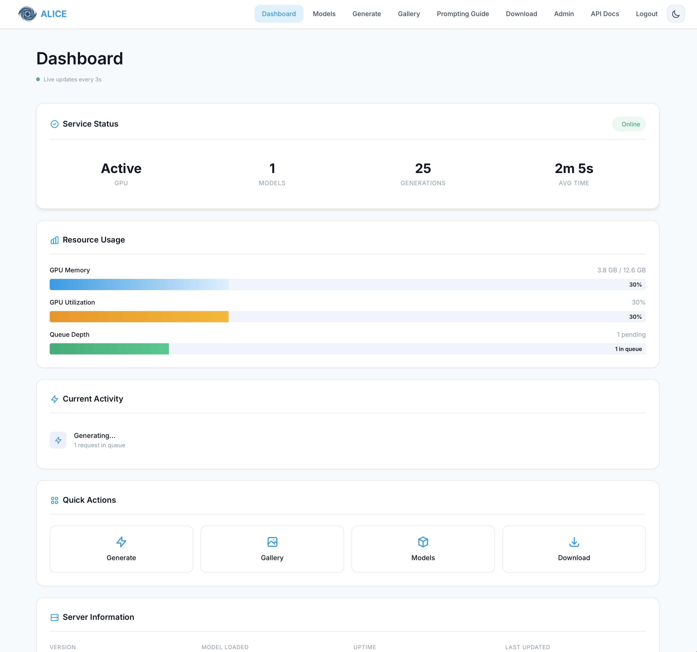
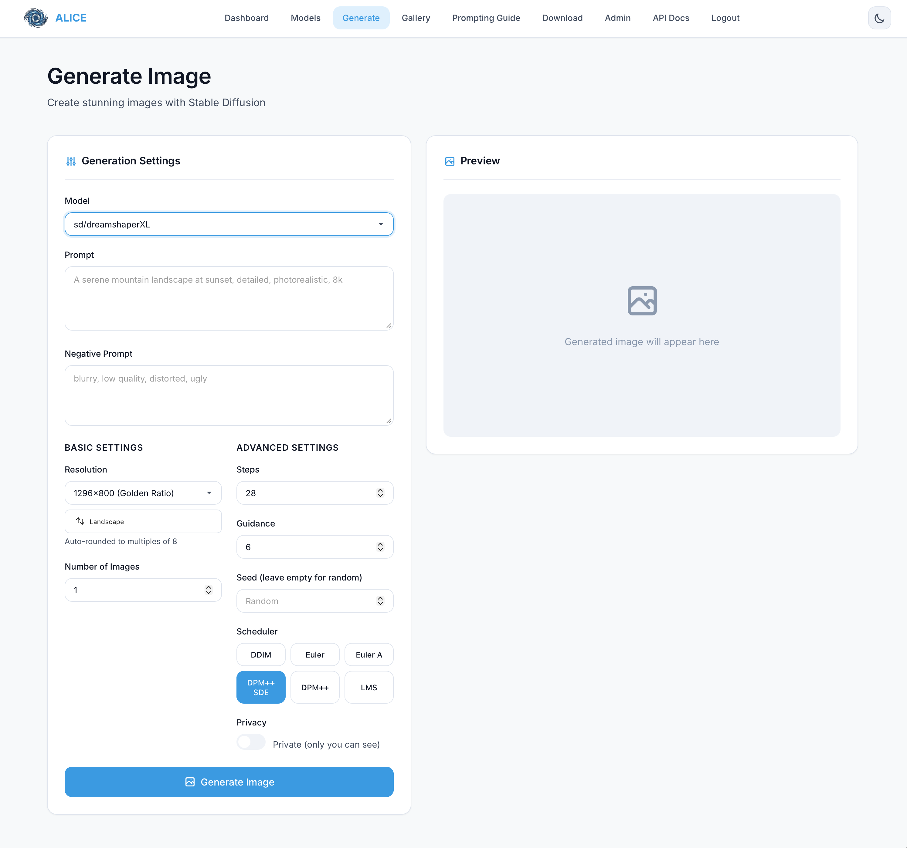

<!-- SPDX-License-Identifier: CC-BY-NC-4.0 -->
<!-- SPDX-FileCopyrightText: Copyright (c) 2025 Andrew Wyatt (Fewtarius) -->

# ALICE

**A standalone local image and audio generation service with a web interface, OpenAI-compatible API, and native integration with SAM.**

I built ALICE for fun. I wanted to generate images and music on my own hardware without paying per image or track. Nothing fit, so I built something that runs Stable Diffusion and audio models locally — through a web UI, an OpenAI-compatible API, or SAM's chat.

[Website](https://www.syntheticautonomicmind.org) | [GitHub](https://github.com/SyntheticAutonomicMind/ALICE) | [Issues](https://github.com/SyntheticAutonomicMind/ALICE/issues)

[](https://www.gnu.org/licenses/gpl-3.0)
[](https://www.python.org/)
[](https://fastapi.tiangolo.com/)

---

## What Is ALICE?

ALICE is a Python service that runs Stable Diffusion image generation and audio synthesis on your hardware. It provides a web management interface, an OpenAI-compatible REST API, and a model download manager. You run it locally, download models from CivitAI or HuggingFace, and generate without cloud uploads or per-image cost.

ALICE is the serving and orchestration layer. The model weights are separate — Stable Diffusion, FLUX, and audio models are downloaded to your machine and loaded at request time.

```
                    REQUEST
                       |
                       v
         +----------------------+
         |       ALICE API      |
         |  FastAPI + Web UI    |
         +----------+-----------+
                    |
         +----------+----------+
         |                     |
         v                     v
    PyTorch Backend       sdcpp Backend
   (CUDA/ROCm/MPS/CPU)   (Vulkan / CPU)
         |                     |
         v                     v
   AudioEngine           Model Cache
   (Stable Audio /      (LRU, VRAM-aware)
    MiniMax Music 3)
```

---

## What Can It Do?

### Image Generation

- **Text-to-image** — SD 1.5, SD 2.x, SDXL, and FLUX models
- **Image-to-image** — provide an input image and a prompt to transform it (style transfer, denoising, variation)
- **Multiple schedulers** — DPM++, Euler, DDIM, Heun, and others
- **Full parameter control** — steps, guidance scale, seed, width, height, negative prompt, scheduler, strength (img2img)

### Audio Generation

- **Stable Audio Open 1.0** — 47 seconds of stereo audio at 44.1 kHz from a text prompt
- **MiniMax Music 3** — up to 6-minute songs with lyrics and structured music descriptions

Both share the same GPU as image generation. VRAM-aware context switching evicts the least-recently-used model when memory runs tight.

### Model Management

- **Model discovery** — search CivitAI and HuggingFace from the web interface
- **One-click download** — `.safetensors` files and diffusers directories
- **Hot-swapping** — switch models at runtime without restarting
- **VRAM context switching** — audio and image models share the same GPU

### Web Interface

- Dashboard with GPU monitoring, queue status, recent generations
- Generation studio with full parameter controls
- Private gallery with per-image privacy controls and time-limited public sharing
- Model browser and download manager (admin-only)
- Interactive API explorer with example requests

### API

- OpenAI-compatible REST API — `POST /v1/chat/completions` for images, `POST /v1/audio/generations` for audio
- Session-based authentication with API key management
- Image serving at `/images/{filename}`, audio at `/v1/audio/{filename}`

### Hardware Support

| Platform | Backend | Notes |
|---|---|---|
| NVIDIA | PyTorch (CUDA) | 8 GB+ VRAM recommended |
| AMD | PyTorch (ROCm) or sdcpp (Vulkan) | Full support including Steam Deck |
| Apple Silicon | PyTorch (MPS) | M1/M2/M3/M4 |
| CPU | PyTorch or sdcpp | Works on any system |

ALICE uses a dual backend architecture: PyTorch for full `diffusers` pipeline support, and `stable-diffusion.cpp` for Vulkan-based universal GPU acceleration without vendor driver dependencies.

---

## How Does It Work?

```
Client (SAM, CLIO, Web, or API caller)
   |
   v
FastAPI HTTP Server (port 8080 by default)
   |
   v
GeneratorService (orchestrator)
   |
   +--> PyTorchBackend (CUDA / ROCm / MPS / CPU)
   |                                    |
   +--> SDCppBackend (Vulkan / CPU)    |
   +--> AudioBackend (Stable Audio /  |
          MiniMax Music 3)             |
   |                                    |
   v                                    v
Model Cache (LRU, VRAM-aware)     Model Weights
   |                                    (downloaded from
   v                                     CivitAI/HF)
Response
```

---

## Where Does It Fit?

ALICE is part of [Synthetic Autonomic Mind](https://github.com/SyntheticAutonomicMind):

| Project | Role |
|---|---|
| **SAM** | [Native macOS AI assistant](https://github.com/SyntheticAutonomicMind/SAM) — conversation, voice, documents. Connects to ALICE for image/audio generation |
| **CLIO** | [Terminal-native AI development agent and extensible agent harness](https://github.com/SyntheticAutonomicMind/CLIO) — orchestrates ALICE deployments via remote execution |
| **ALICE** | Local image and audio generation service (this repository) |
| **CLIO-helper** | [GitHub automation powered by CLIO](https://github.com/SyntheticAutonomicMind/CLIO-helper) |

---

## Quick Start

ALICE needs two things: the software (below) and at least one model. See [Getting Models](#getting-models) after installing.

### macOS (SAM integration)

Apple Silicon gets GPU acceleration via MPS. Intel runs CPU-only.

```bash
# Install Python 3.10+
brew install python

# Install ALICE as a background service (starts automatically at login):
git clone https://github.com/SyntheticAutonomicMind/ALICE.git && cd ALICE
./scripts/install_macos.sh

# Or install without the background service:
./scripts/install_macos.sh --manual
```

**Service management:**
```bash
launchctl start com.alice            # Start
launchctl stop com.alice             # Stop
tail -f ~/Library/Logs/alice/alice.log  # Logs
```

**Connect to SAM:**
1. Verify ALICE is running: `http://localhost:8080/health`
2. In SAM: Settings > Image Generation > set server URL to `http://localhost:8080`
3. Download a model (see [Getting Models](#getting-models))
4. Ask SAM to generate an image

For full macOS setup, see [docs/MACOS-DEPLOYMENT.md](docs/MACOS-DEPLOYMENT.md).

### Linux (one-liner)

```bash
TAG="$(curl -s https://api.github.com/repos/SyntheticAutonomicMind/ALICE/releases/latest | python3 -c "import sys,json;print(json.load(sys.stdin)['tag_name'])")"
VERSION="${TAG#v}"
curl -sL "https://github.com/SyntheticAutonomicMind/ALICE/releases/download/${TAG}/alice-${VERSION}.tar.gz" | tar xz && cd alice-* && sudo ./scripts/install.sh
```

Installs as a systemd service to `/opt/alice`. Detects AMD (ROCm), NVIDIA (CUDA), and CPU automatically.

### Docker

```bash
git clone https://github.com/SyntheticAutonomicMind/ALICE.git && cd ALICE
make docker-up-cuda   # NVIDIA
make docker-up-rocm   # AMD
make docker-up        # CPU only
```

---

## Getting Models

ALICE needs at least one model to generate images. Models are large files (2-10 GB) downloaded from CivitAI or HuggingFace — ALICE doesn't ship with them.

### Recommended: SDXL (1024x1024)

Requires about 6-8 GB of memory (unified memory on Apple Silicon).

- **[Juggernaut XL](https://civitai.com/models/133005)** — photorealistic, great all-rounder
- **[DreamShaper XL](https://civitai.com/models/112902)** — handles artistic styles well

### For lower-memory systems: SD 1.5 (512x512)

- **[Realistic Vision](https://civitai.com/models/4201)** — photorealistic
- **[Deliberate](https://civitai.com/models/4823)** — detailed and flexible

### Download

**Option 1 — ALICE web interface:** Open `http://localhost:8080/web/`, go to the **Download** tab, search for a model, click Download.

**Option 2 — Download manually:** Place a `.safetensors` file in:

- macOS: `~/Library/Application Support/alice/data/models/`
- Linux: `/var/lib/alice/models/`

ALICE auto-discovers models on startup. Refresh in the web UI under **Models > Refresh**.

---

## Supported Models

### Image Models
- Stable Diffusion 1.5 (512x512)
- Stable Diffusion 2.x (768x768)
- SDXL (1024x1024)
- FLUX
- Custom models (`.safetensors` or diffusers directory)

### Audio Models
- **Stable Audio Open 1.0** — 47s stereo at 44.1 kHz from text prompts
- **MiniMax Music 3** — up to 6-minute songs with lyrics and structured music description

See [docs/AUDIO-GENERATION.md](docs/AUDIO-GENERATION.md) for the full audio configuration and ROCm notes.

---

## What's an Example?

```text
Generate an image locally using the selected model,
then retrieve it through the API.
```

Via the API:

```bash
curl -X POST http://localhost:8080/v1/chat/completions \
  -H "Content-Type: application/json" \
  -d '{
    "model": "sd/stable-diffusion-v1-5",
    "messages": [{"role": "user", "content": "a serene mountain landscape at sunset"}],
    "samConfig": {"steps": 30, "guidance_scale": 7.5, "width": 512, "height": 512}
  }'
```

---

## Screenshots

<table>
  <tr>
    <td width="50%">
      <h3>Dashboard and control center</h3>
      
      <em>Real-time GPU monitoring and quick generation access</em>
    </td>
    <td width="50%">
      <h3>Generation studio</h3>
      
      <em>Full parameter controls: model selection, schedulers, guidance scale</em>
    </td>
  </tr>
</table>

<table>
  <tr>
    <td width="50%">
      <h3>Private gallery</h3>
      
      <em>Organize generated images with privacy controls and metadata</em>
    </td>
  </tr>
</table>

---

## Configuration

Edit `config.yaml` to customize ALICE: server settings, model defaults, generation parameters, storage limits, NSFW filtering.

---

## Requirements

- Python 3.10+
- 16 GB RAM minimum (32 GB recommended for SDXL)
- 50 GB+ disk for model storage
- 8 GB+ VRAM recommended (4 GB for smaller models)

Key dependencies: PyTorch 2.6.0, diffusers 0.35.2, FastAPI 0.104.1. See [requirements.txt](requirements.txt).

---

## Privacy and Data

ALICE runs on your hardware. Generated images and audio stay local by default. Model files are downloaded from CivitAI or HuggingFace to your machine. When ALICE exposes its API to networked clients, those clients must authenticate via API keys or session tokens.

---

## Documentation

| Document | What You'll Find |
|---|---|
| [macOS Deployment](docs/MACOS-DEPLOYMENT.md) | Full macOS setup and troubleshooting |
| [AMD Deployment](docs/AMD-DEPLOYMENT-GUIDE.md) | AMD/ROCm setup including Steam Deck |
| [Audio Generation](docs/AUDIO-GENERATION.md) | Stable Audio Open 1.0 and MiniMax Music 3 setup |
| [Architecture](docs/ARCHITECTURE.md) | System design and internals |
| [Implementation Guide](docs/IMPLEMENTATION_GUIDE.md) | Development guide |
| [API Usage](docs/API-USAGE.md) | API guide with examples |
| [Backend Architecture](docs/BACKEND-ARCHITECTURE.md) | PyTorch and stable-diffusion.cpp backends |
| [Website](https://www.syntheticautonomicmind.org) | Online guides and updates |

---

## License

GPL-3.0. Created by Andrew Wyatt (fewtarius).

[Website](https://www.syntheticautonomicmind.org) | [github.com/SyntheticAutonomicMind/ALICE](https://github.com/SyntheticAutonomicMind/ALICE)

Built with: [Stable Diffusion](https://github.com/CompVis/stable-diffusion), [diffusers](https://github.com/huggingface/diffusers), [FastAPI](https://github.com/tiangolo/fastapi), [PyTorch](https://pytorch.org/)
